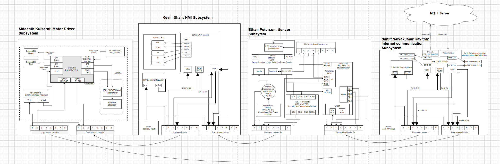

**Link to Drive:**

[Block Diagram](https://drive.google.com/drive/folders/19I_488VRz9nsvQRNoa4jgeBesulI3tln?dmr=1&ec=wgc-drive-hero-goto)

**Overall Team Subsystem Layout:**

Look under Individual block diagrams for a closer look into our block diagrams describing the temperature and humidity sensor system.

# Block Diagram Decision-Making & Requirements Alignment

## 1. Decision-Making Process

1. **Role-Based Functional Partitioning**  
   - **Why**: Each team member owned a distinct subsystem (Sensor, HMI, Motor, Web/MQTT).  
   - **How**: We drew four blocks—Ethan’s Sensor, Kevin’s HMI, Siddhant’s Motor Driver, Sanjit’s Web/MQTT—and showed a linear data flow through them.

2. **Daisy-Chain UART Bus**  
   - **Why**: Minimizes wiring complexity and PCB pin usage.  
   - **How**: Added a single upstream and downstream header on each board. Messages hop from one MCU to the next, using the fixed-length header/footer and byte-addressing to reach the intended destination.

3. **Local I²C & SPI Buses for Peripherals**  
   - **Why**: LCD, DHT11/BMP180 sensors, and motor driver chips require I²C or SPI.  
   - **How**: Inside each block, we annotated I²C connections to sensors/displays and SPI to the ILI9341 LCD, highlighting protocol separation (UART vs. I²C/SPI).

4. **Integrated Wi-Fi/MQTT Link on HMI Board**  
   - **Why**: Eliminates a standalone gateway PCB and leverages the ESP32’s dual role (display control + cloud connectivity).  
   - **How**: Drew the ESP32 Wi-Fi module wired to the same UART bus, with a “cloud” icon linked via Wi-Fi arrows to an external MQTT Server.

5. **Dedicated 3.3 V Regulators on Every Board**  
   - **Why**: Guarantees stable power and isolates noise between subsystems.  
   - **How**: Each block in the diagram includes its own switching regulator symbol between the 9 V barrel jack input and the MCU’s VDD.

---

## 2. How the Block Diagram Meets Product Requirements

- **Real-Time Feedback (< 500 ms latency)**  
  - UART daisy-chain with deterministic framing ensures predictable message transit times.  
  - I²C/SPI peripherals respond within microseconds, enabling sub-second end-to-end updates.

- **Modularity & Scalability**  
  - Clear demarcation of each subsystem allows future boards to “plug in” to the UART chain and be assigned new Source/Dest IDs.  
  - Students can swap or upgrade a block (e.g., swap DHT11 for a BME280) without redrawing the entire diagram.

- **Educational Clarity**  
  - Linear, left-to-right flow mirrors the physical wiring and power hierarchy, making it easy for K-12 audiences to trace “power → sense → display → actuation → cloud.”

- **Robust Power Architecture**  
  - Separate switching regulators on each PCB guarantee that high-current motor draws do not brown-out sensitive sensor and display circuits.

- **Cloud & Local Interfaces**  
  - Dual interfaces (physical buttons/LCD + MQTT) satisfy both hands-on exhibit requirements and remote monitoring use cases.

- **Error Isolation & Safety**  
  - Drawing error-message paths (Type 6 frames) in the diagram underlines how each board can report faults back through the same chain, triggering safe shutdowns or alerts on the LCD.

---
How did the decision making process operate for how we made our block diagram:
---

Our block diagram is a simplified version of what we wanted to create for our project. It demonstrates that we have met the product requirements, as each individual system passed its checkoff by incorporating the necessary components for its subsystem design.

However, all designs required a voltage regulator, a UART plug-in, a microcontroller, and clearly defined TX and RX connections. Each block diagram must explicitly indicate where the TX and RX lines connect to the microcontroller. If this is not explicitly stated, it must be evident from the schematic corresponding to that subsystem.

The block diagram provides a basic overview of the system’s layout and operation. Additionally, it helps illustrate how information flows within the team. As shown, the data starts with Sanjit, moves to Ethan, then Kevin, and finally reaches Siddhant, who operates the actuator.
