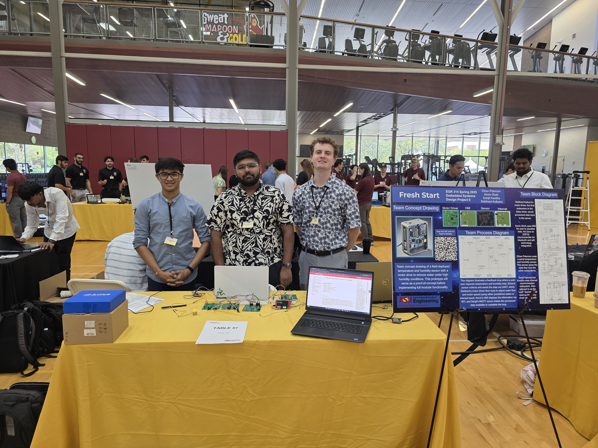

# 🏆 **Welcome to Team Fresh Start - Team 308**

---

## 🏛 **Team Details**
- **🔢 Team Number:** 308  
- **📅 Preparation Date:** January 16, 2025  
- **📆 Semester & Year:** Spring 2025  
- **🏫 Institution:** Arizona State University  
- **📖 Course:** EGR 314  
- **👨‍🏫 Instructor:** Prof. Nichols  

---

## Introduction  
Welcome! Our team, **Team Fresh Start - Team 308**, is excited to present our interactive, STEM-focused project. As part of our **EGR 314** course, we are tasked with designing and delivering an innovative, web-enabled device that will captivate K-12 students by demonstrating a scientific or engineering concept. Our project aims to create a hands-on educational tool that encourages exploration of STEM fields, while adhering to industry standards and focusing on energy efficiency, modularity, and user engagement.

---

## Mission Statement  
Our mission is to develop a STEM-oriented, interactive educational display that showcases real-time scientific data in an engaging and intuitive way. The system is designed to replicate an **AC system** that uses chilled water as a coolant, with an actuator that allows or disallows water through the system. Our goal is to inspire curiosity in K-12 students by providing an energy-efficient and scalable solution that fosters learning through innovative design and functionality.

---

## 👥 **Meet Our Team**  
🔹 [Ethan Peterson](https://ejpete10.github.io/test_Datasheet.github.io/) - ethan@socal.rr.com  
🔹 [Kevin Shah](https://kshah79.github.io/kshah79/) - kshah79@asu.edu  
🔹 [Sanjit Kavitha](http://sanjitsk.github.io) - sselvak4@asu.edu  
🔹 [Siddhant Kulkarni](https://smkulka6.github.io/smkulka6/) - smkulka6@asu.edu  

---

## Project Summary  
Our team is developing a **weather monitoring system** that reads temperature and controls the flow of chilled water via an actuator. If the user deems it necessary, excess water is expelled using a motor. The product is versatile, providing rapid updates both online and through the physical HMI interface. Though designed for general applications, it may be particularly useful in agricultural settings for regulating crop water exposure and temperature settings.

In addition to its practical applications, the system can be a tool for K-12 students to learn how sensors operate, as well as how to design flowchart-driven devices without delving deeply into complex circuit design.

---

## Team Goals  
- Deliver a high-quality, market-ready product  
- Collaborate effectively with clear communication and timely deadlines  
- Design with sustainability and industry standards in mind  
- Create an engaging user experience that promotes STEM education  
- Maximize innovation and technical proficiency while addressing real-world challenges

---

## Final Team Picture

---

## Team Coordination & Accountability  
- **Ethan Peterson**: Assignment Leader  
- **Kevin Shah**: Documentation Head  
- **Sanjit Selvakumar Kavitha**: Electrical Head  
- **Siddhant Kulkarni**: PCB Head  

---

© 2025 Team Fresh Start | Arizona State University

